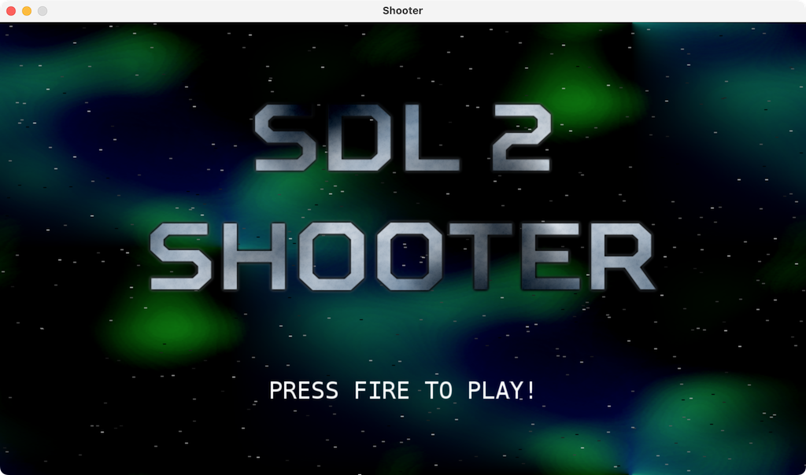

# SDL2FPC-Tutorials

### sdl2Shooter



### Build

Make sure sdl2forpascal package is inside the pkg folder  
```bash
export FPCPKGDIR=../../pascal/pkg
make write-shooter01
make build-shooter01
```

Original version programing in C, Made by [Parallel Realities](https://www.parallelrealities.co.uk).

### License

Copyright (C) 2015-2018,2022 Parallel Realities. All rights reserved.

Copyright changed to:

Copyright © CHUNQIAN SHEN, 2023. All Rights Reserved.

Licensed under the Apache License, Version 2.0 (the "License"); you may not use this file except in compliance with the License.

You may obtain a copy of the License at

[http://www.apache.org/licenses/LICENSE-2.0](http://www.apache.org/licenses/LICENSE-2.0)

Unless required by applicable law or agreed to in writing, software distributed under the License is distributed on an "AS IS" BASIS, WITHOUT WARRANTIES OR CONDITIONS OF ANY KIND, either express or implied.  See the License for the specific language governing permissions and limitations under the License.
